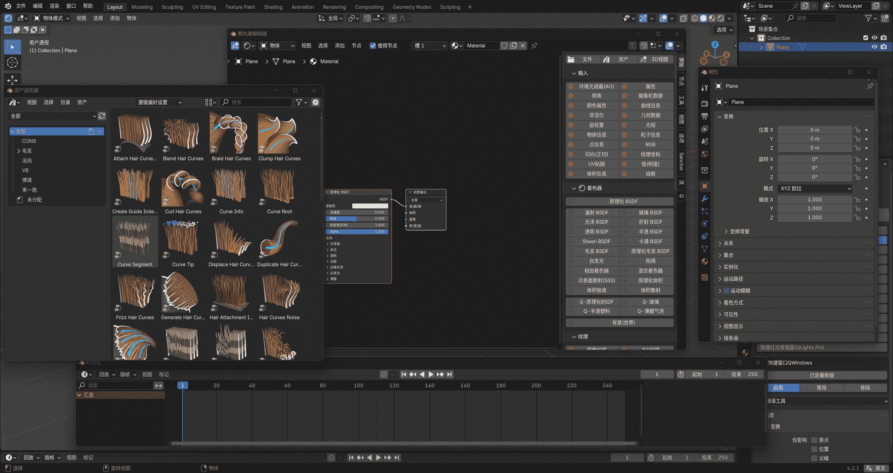
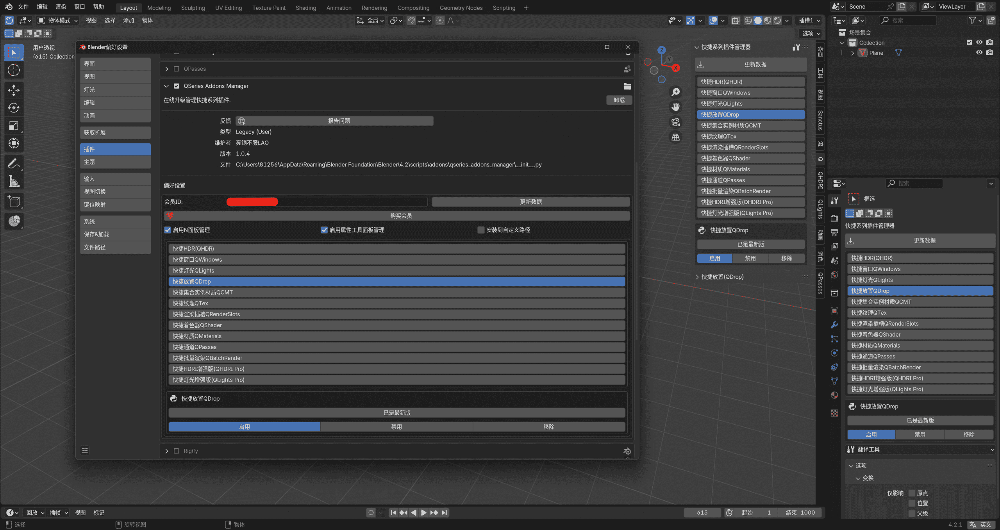

# 快捷系列插件简介

## 快捷灯光增强版(QLights Pro)
快捷灯光增强版是一款超实用/超便捷的Blender灯光插件，它能够让我们在Blender里快速的创建各种类型的灯光，包括`程序渐变灯光`、`纹理灯光`、`IES灯光`，提供多种灯光控制方式，让我们打光更轻松更精准。

快捷灯光增强版(QLights Pro)完整支持 `Cycles` 与 `Octane` 渲染器，有限支持 `EEVEE`渲染器（因为EEVEE不支持使用节点） 。

[通过视频了解更多](https://www.bilibili.com/video/BV1QHpneZEXe)

## 快捷HDRI增强版(QHDRI Pro)
快捷HDRI增强版是一款功能强大的HDRI环境照明插件，能够非常方便的管理HDRI、设置阴影捕捉，还可以创建带有云层与星空的程序化天空纹理。

快捷HDRI增强版支持 `Cycles` 、 `EEVEE` 与 `Octane` 渲染器。

[通过视频了解更多](https://www.bilibili.com/video/BV1p2421Z7Ph)

## 快捷通道(QPasses)
快捷通道是一款简洁好用的Blender渲染通道输出插件，只需点击几下就能够快速设置好Blender渲染输出通道，并且能够快速的设置着色AOV输出，大大简化了Blender原生繁琐的渲染通道输出设置流程。

[通过视频了解更多](https://www.bilibili.com/video/BV1hQs4eJEQz)

## 快捷材质(QMaterials)
快捷材质是一款仿照C4D一材质为对象对材质进行管理的Blender插件，在Blender里实现了类似C4D的材质创建、赋予、分类管理与编辑的流程，C4D转Blender用户不可多得的辅助插件。

[通过视频了解更多](https://www.bilibili.com/video/BV1dJ4m1c7pc)

## 快捷着色器(QShader)
快捷着色器（已公开的免费版本叫着色器助手），提供多种添加着色器节点的方式，并集成非常多的实用小功能，大大提高材质编辑器使用效率。

快捷着色器支持 `Cycles` 、 `EEVEE` 与 `Octane` 渲染器

[通过视频了解更多](https://www.bilibili.com/video/BV1h2421L7Jt)

## 快捷纹理(QTex)
快捷纹理是一款轻便的纹理资产管理插件，能够非常方便的管理单张纹理资产与PBR纹理资产，能够快速导入、替换纹理。

[通过视频了解更多](https://www.bilibili.com/video/BV15x42117Nk)

## 快捷批量渲染(QBatchRender)
快捷批量渲染是一款在Blender内实现批量渲染的插件，支持多文件、多场景、多相机批量渲染，支持动画批量渲染，有渲染完成自动关机功能。

[通过视频了解更多](https://www.bilibili.com/video/BV1SD421M7rV)

## 快捷窗口(QWindows)

快捷窗口是一款可以通过往不同方向拖拽鼠标或者快捷键创建各种类型弹窗的插件，特别方便不适合太多窗口分割的小屏幕用户，可自定义窗口大小。

注意：该插件仅支持`Windows`系统，不支持`MAC`与`Linux`。

[通过视频了解更多](https://www.bilibili.com/video/BV1Hw4m1U7Ex)

## 快捷渲染插槽(QRenderSlots)

快捷渲染槽一款能够在渲染之前快速在3D视图设置渲染槽的插件，解决Blender渲染槽设置的痛点。

[通过视频了解更多](https://www.bilibili.com/video/BV1EZ421H73o)

## 快捷放置(QDrop)

快捷放置是一款基于刚体物理效果的模拟放置工具，可以快速为物体添加刚体效果，模拟拿起物体去放置的效果。

[通过视频了解更多](https://www.bilibili.com/video/BV1py42187i8)

## 快捷系列插件管理器

快捷系列插件管理器是专门管理快捷系列插件的一款插件，为会员用户提供插件的在线安装与更新服务，并能够管理快捷系列插件的启用、禁用、卸载。插件内置翻译工具（相当于BLT分支），提供词典下载与中英文界面切换功能。

[通过视频了解更多](https://www.bilibili.com/video/BV13m421g7c3)