# 快捷灯光增强版(QLights Pro)使用教程

::: info 快捷灯光增强版(QLights Pro)
快捷灯光增强版是一款超实用/超便捷的Blender灯光插件，它能够让我们在Blender里快速的创建各种类型的灯光，包括`程序渐变灯光`、`纹理灯光`、`IES灯光`，提供多种灯光控制方式，让我们打光更轻松更精准。

- 支持的Blender版本：`建议Blender4.0及以上，Blender4.0以下版本部分功能不可用`
- 支持的渲染器：`Cycles` `Octane`（Octane插件版目前不能正常使用）
- 支持的操作系统：`Windows` `Mac OS` `Linux`
:::

## 插件安装

1.通过快捷系列插件管理器即可在线下载安装/更新快捷灯光 `如果无法下载新上架的插件，请到会员群更新最新版插件管理器。`；

2.通过快捷系列插件管理器自带的翻译工具下载词典即可实现中英文版本切换；

3.管理器翻译工具自带中英文切换按钮，位于Blender右下角状态栏。

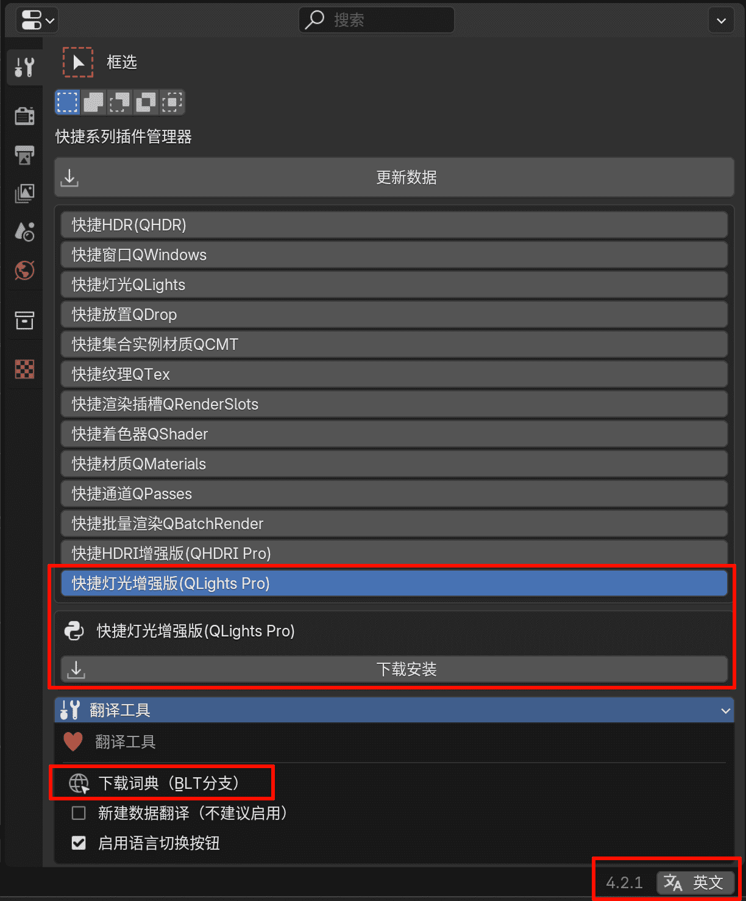

## 插件设置

### 设置面板位置

插件有两个区域会出现设置面板 `插件偏好设置面板` `N面板的设置子面板`

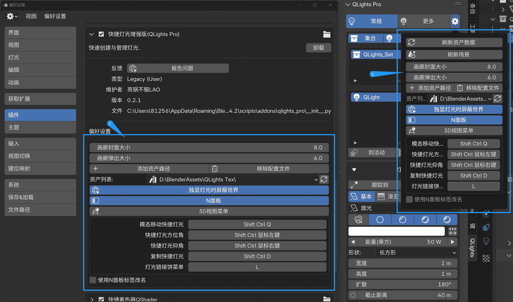

### 资产设置

#### 添加资产库

`请先到群文件下载插件插件自带资产库或者自己整理好自己的资产库`

在插件偏好设置点击 `添加资产路径` 按钮即可添加资产，可以添加多个资产；

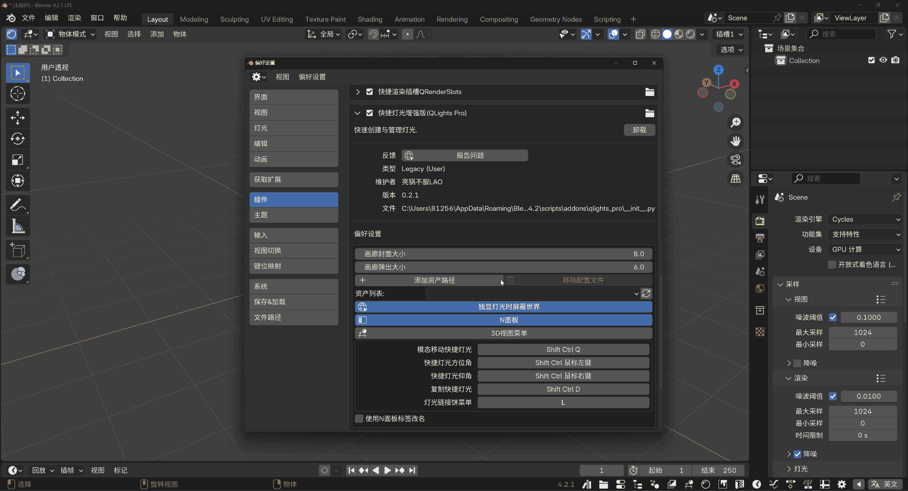

::: tip 注意事项
添加资产时必须保证文件名输入框为空，如果有文件名请手动删除。

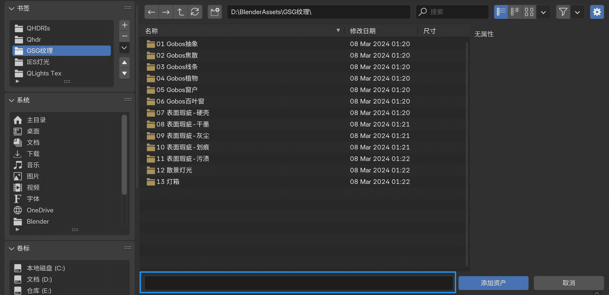
:::

添加资产后配置文件是保存在本地的，即使卸载插件配置文件也依旧存在，卸载后重新安装插件点击刷新按钮或重启Blender可自动加载之前设置好的资产，点击 `移除配置文件` 按钮即可删除本地资产路径配置文件。

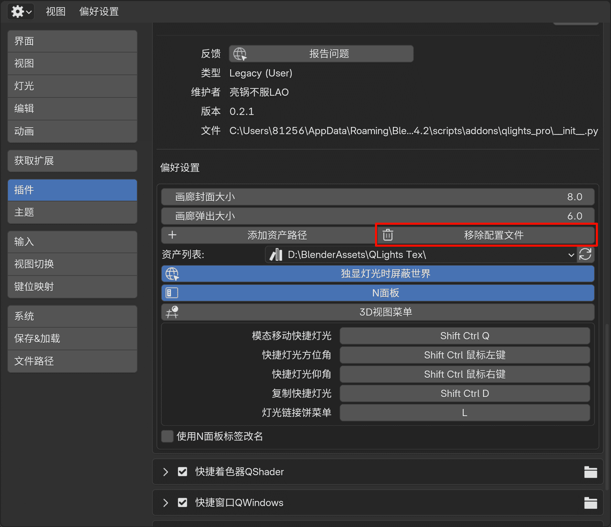

#### 资产整理规范

插件自带一个资产库，包含图像灯光纹理与IES灯光纹理，也可以自己整理资产库，资产库必须遵循一定的规则才能被插件识别。

::: tip 资产库创建步骤
- 新建一个 `文件夹` 作为资产库，然后在该文件夹下新建N个 `子文件夹` 对资产进行分类（必要步骤），图像纹理与IES纹理可以放在同一个资产库也可以独立创建不同的资产库，IES纹理分类文件夹名称最好包含 `IES` 字符，方便插件识别，能够规避一些不必要的报错；

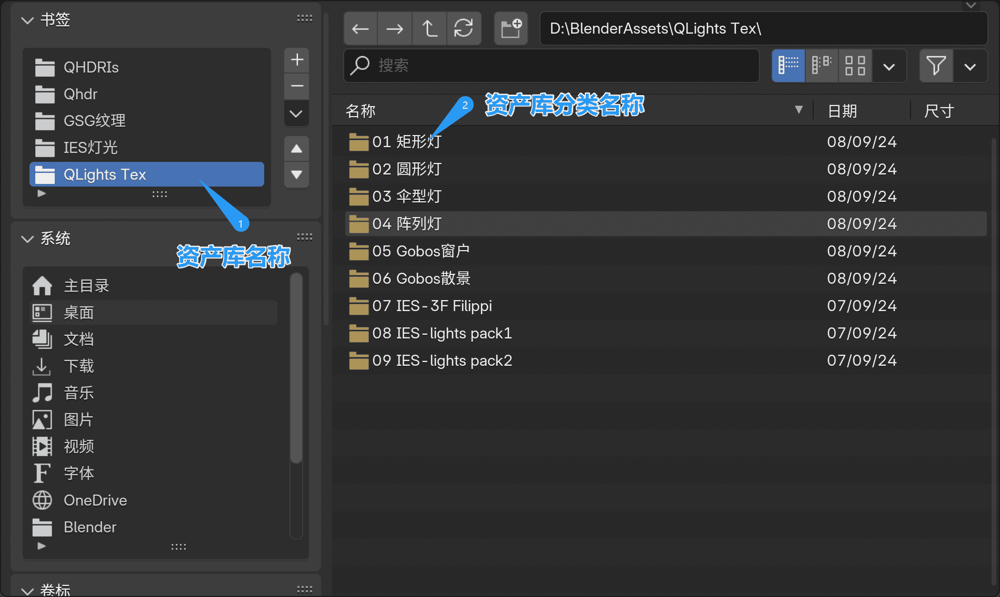

- 在分类子文件夹放入纹理资产。

    1. 图像纹理资产直接放入图像即可；

    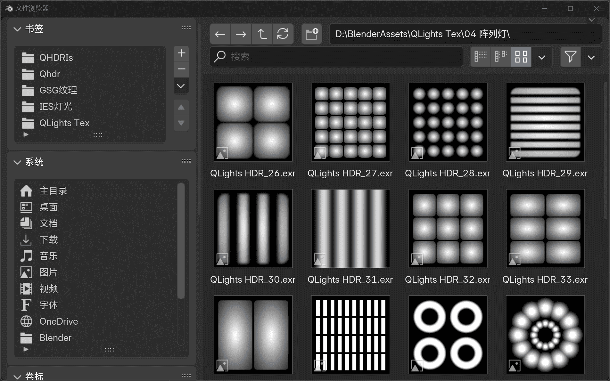

    2. IES纹理除了需要放入.ies文件之外，还需要放入一个.png的同名文件做为预览图 `建议分辨率256*256`。

    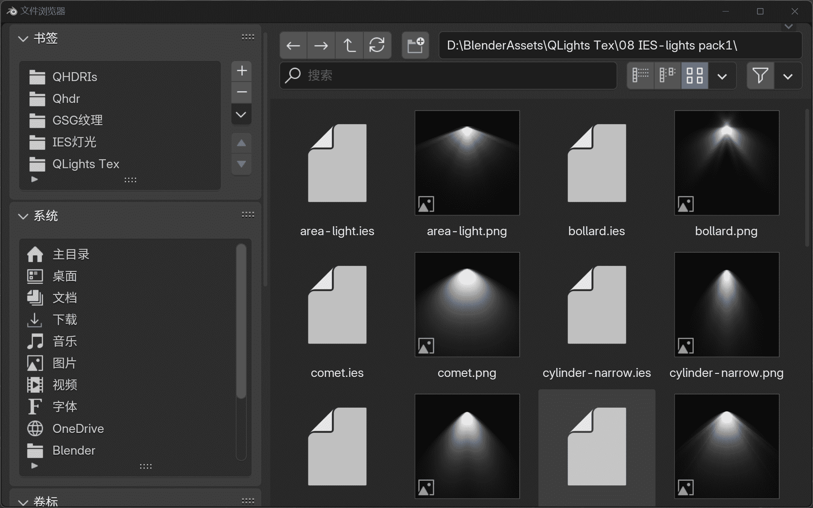

:::

### 其它设置

在插件的设置面板除了设置资产外还可以对`资产画廊的显示`和插件的`快捷键`等进行设置。

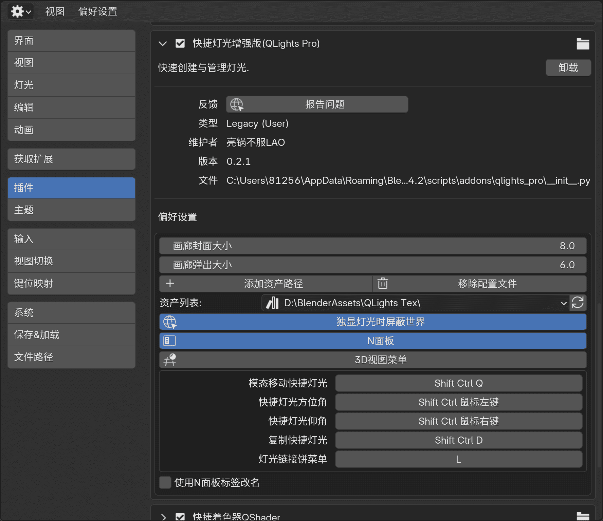

## 灯光的创建与管理

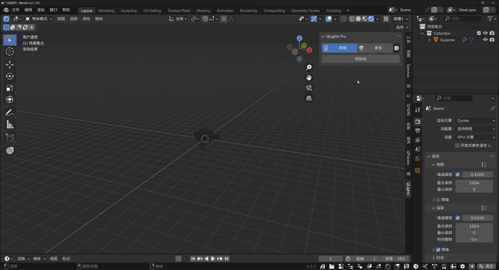

首次使用点击 `初始化` 按钮会出现灯光管理界面，灯光管理界面分为 `灯光集合` 列表与 `灯光` 列表 ；

点击 `集合` 或 `灯光` 按钮可以切换灯光集合或灯光管理面板的显示与隐藏，点击 `移除` 按钮可以移除创建的所有快捷灯光。

### 灯光集合列表
灯光集合用来对灯光进行分组管理，灯光集合列表显示所有的灯光集合，点击列表旁的 `+` 按钮可以新建灯光集合，点击 `-` 按钮可以删除灯光集合；

### 灯光列表
灯光列表显示当前灯光集合内所有灯光，点击列表旁的 `+` 按钮可以新建灯光，点击 `-` 按钮可以删除灯光；

创建灯光时，激活 `到活动` 或者 `到游标` 按钮灯光会创建在对应位置。

## 灯光控制

### 普通模式

快捷灯光在普通模式下与默认灯光的控制没有任何区别，可以随意在3D视图移动旋转缩放；

#### 添加目标约束

选择快捷灯光后，点击面板上的 `跟踪到` 按钮可以给灯光添加一个目标约束，点击吸管按钮可以在3D视图拾取一个目标对象。

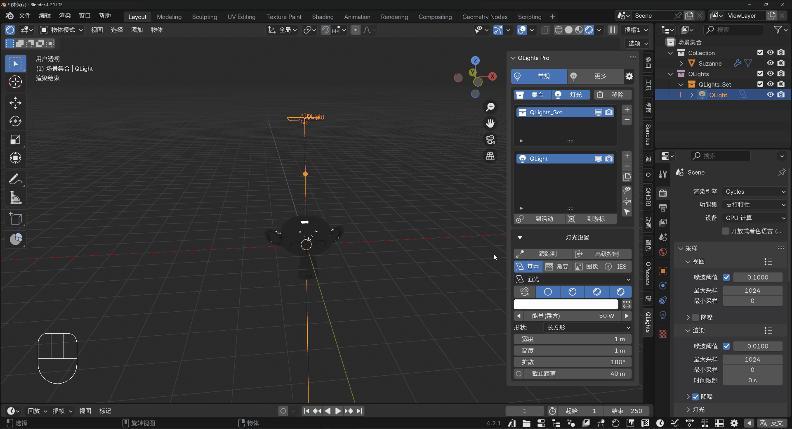
