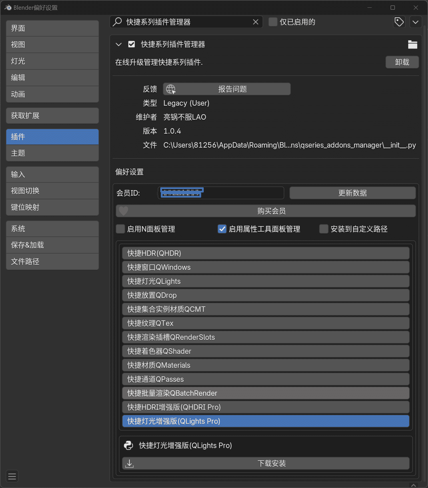

# 快捷系列插件管理器使用教程

## 下载与安装

在会员群群文件下载快捷系列插件管理器最新版，按照Blender默认插件安装方式安装即可`插件分为Windows版与MacOS版本，请下载对应的版本`。

## 填写会员ID

快捷系列插件管理器必须正确填写会员ID号`工房订单号后八位`后才能下载快捷系列插件；

> 会员ID号`工房订单号后八位`可以从购买订单详情获取，最简单的获取方式是直接查看工房订单，可能需要从手机APP端查看 `B站工房体验及其糟糕，就是个半成品，很多人找不到入口。`或者直接私信我，我会将订单号发给你。
> 
> APP端查看流程：
> 

输入会员ID后，点击`更新数据`按钮就会出现插件下载列表；

## 安装与更新

在插件列表选择插件就会在最下面看到插件名称与`下载安装`按钮，点击按钮就会下载并安装插件（`如果无法下载新上架的插件，请到会员群更新最新版插件管理器。`）；

> 插件管理面板除了会显示在插件的偏好设置选项外，默认也会显示在属性面板的工具属性里，也可以显示在N面板`需要自己在偏好设置里勾选`。
> 

安装后选择`启用`即可，同时也可以在这里选择`禁用`或者`移除`；

安装后如果有新的版本，会有更新提示，点击即可更新；

插件支持安装到自定义脚本路径。
> 要安装到自定义脚本路径必须先在偏好设置里设置Blender脚本路径；
> 
> 再到管理器插件的偏好设置里勾选`安装到自定义路径`，再到下面的脚本列表里选择一个脚本路径即可`需手动选择而不是输入`
> 
## 翻译工具

新开发的插件默认为英文版，插件没有内置多语言，因此采用Blender的全局翻译来翻译中文版。
内置全局翻译词典基于BLT词典扩展，所以也可以翻译BLT能翻译的插件。

点击管理面板的`翻译工具`选择`下载词典`即可下载全局词典，下载完成会提醒重启Blender。

勾选`启用语言切换按钮`会在Blender右下角状态栏出现一个语言切换按钮，可以在中英文界面之间切换。