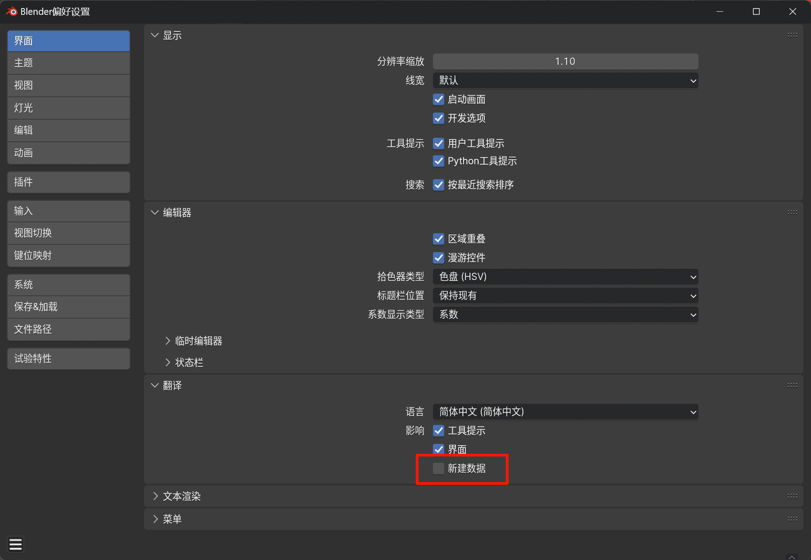
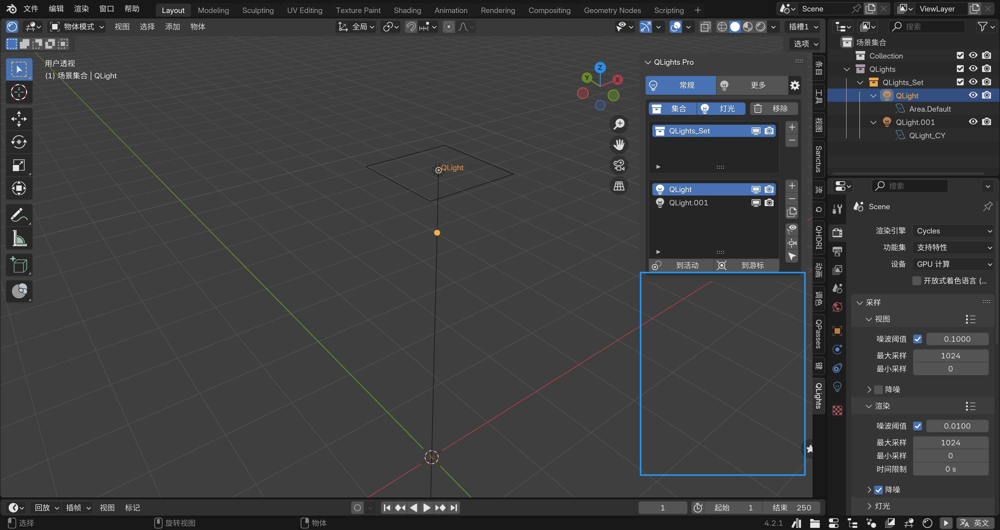
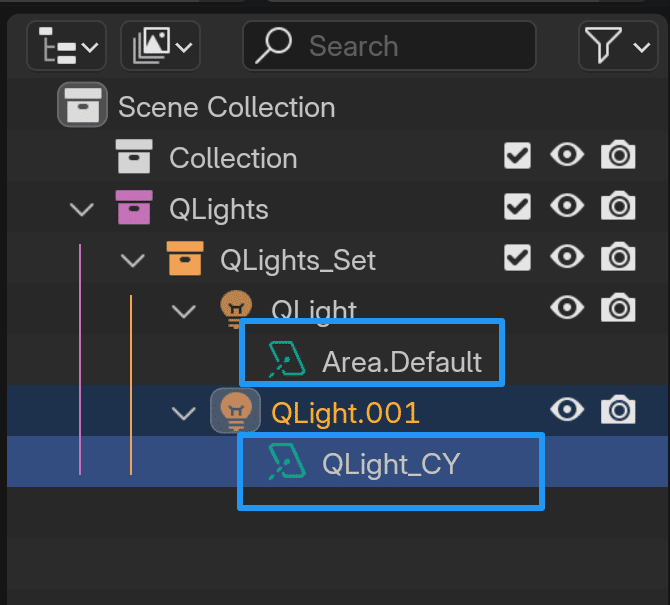

# 常见问题解答

## 不要启用新建数据翻译
在中文界面下使用强烈不建议开启`新建数据`翻译，会导致很多插件无法正常使用。

## 快捷通道初始化报错

请在界面翻译里关闭 `新建数据` 翻译，会导致很多插件无法正常使用。

如果关闭后还是报错，可能是因为已有 `视图层` 节点已经是中文名，可在合成器里删除 `视图层` 节点后再新建一个 `视图层` 节点即可，

## 快捷灯光添加目标没反应

请在界面翻译里关闭 `新建数据` 翻译，会导致很多插件无法正常使用。

中文名称的数据插件无法识别导致的。

## 点击切换语言按钮会报错

请确保已下载词典且重启BLender后再使用！

## 快捷灯光不显示灯光属性

如果创建快捷灯光后在选择灯光后出现灯光属性版面不显示的问题，如下图：

到大纲视图展开灯光数据，如果灯光数据名称不是 `QLight_` 开头而是被改成了 `Area.Default` 开头，那应该是安装了一款名为 `Light Wrangler` 的插件导致的。

`Light Wrangler` 插件默认会修改场景里所有灯光数据的名称，即使你没有使用它。这样会导致快捷灯光插件无法识别该灯光是否是快捷灯光。

::: danger 解决办法
如果该插件不是常用插件，建议卸载或禁用；

如果不想卸载该插件，可以去该插件的偏好设置 - `Advanced Settings（高级设置）` - 取消勾选 `Light Customization (Cycles-only)` 选项。

:::

